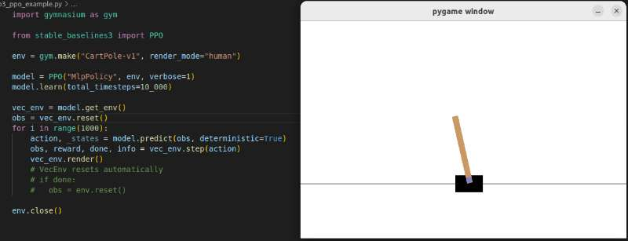

# Proximal Policy Optimization(PPO)
## Reinforcement Learning(RL)
Reinforcement Learning (RL) is a type of machine learning technique where an agent learns to make decisions by interacting with an environment. The agent takes actions in the environment and receives rewards as feedback. The goal of the agent is to learn a surrogate policy fuction that maximizes the cumulative reward over time. By exploring different actions and receiving rewards, the agent learns to make better decisions and improve its performance in the environment. RL is widely used in various applications such as game playing, robot control, and autonomous driving.

<p align="center">  
    
</p>

## PPO
[[openai-PPO]](https://spinningup.openai.com/en/latest/algorithms/ppo.html) [[paper]](https://arxiv.org/abs/1707.06347) [[SB3]](https://github.com/DLR-RM/stable-baselines3)
### Background
 How can we take the biggest possible improvement step on a policy using the data we currently have, without stepping so far that we accidentally cause performance collapse?Inorder to adress the issue of __training stability__ in reinforcement learning algorithms,PPO was proposed.PPO is a family of first-order methods that use a few other tricks to keep new policies close to old.

### PPO mathmatical formulation
略,详细见论文.
### Exploration vs. Exploitation
__Off-policy__ algorithms can use previously collected sample data (potentially generated by other policies) to update the current policy, independent of the current sampling policy.PPO trains a stochastic policy in an __on-policy__ way. This means that it explores by sampling actions according to the latest version of its stochastic policy. The amount of randomness in action selection depends on both initial conditions and the training procedure. Over the course of training, the policy typically becomes progressively less random, as the update rule encourages it to exploit rewards that it has already found. This may cause the policy to get trapped in local optima.

### Stable-baseline3
First create a conda environment:```conda create -n SB3 python==3.9```.Then install the stable-baseline3:```pip install stable-baselines[extra]```.Here is a quick example of how to train and run PPO on a cartpole environment:

```python
import gymnasium as gym

from stable_baselines3 import PPO

env = gym.make("CartPole-v1", render_mode="human")

model = PPO("MlpPolicy", env, verbose=1)
model.learn(total_timesteps=10_000)

vec_env = model.get_env()
obs = vec_env.reset()
for i in range(1000):
    action, _states = model.predict(obs, deterministic=True)
    obs, reward, done, info = vec_env.step(action)
    vec_env.render()
    # VecEnv resets automatically
    # if done:
    #   obs = env.reset()

env.close()
```
The result of the obove code:


