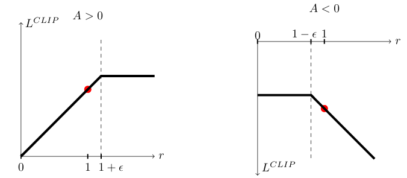

# Policy Optimization
## Policy Gradient Methods
Policy gradient methods work by __computing an estimator of the policy gradient(近似估计)__ and plugging it into a stochastic gradient ascent algorithm.The most commonly used gradient estimator has the form:
```math
\hat{g} = \widehat{\mathbb{E}}_t \left[ \nabla_\theta \log \pi_\theta(a_t \mid s_t) \hat{A}_t \right]
```
* $\hat{g}$ represents the estimated gradient of the expected return.
* $\hat{\mathbb{E}_t }$ denotes the empirical expectation over time steps t.
* $\nabla_\theta$ is the gradient with respect to the parameters θ of the policy.
* $\log \pi_\theta(a_t \mid s_t)$  is the log-probability of taking action $a_t$ given state $s_t$ under the policy $\pi_\theta$.
* $\hat{A}_t$ is an estimate of the advantage function at time step t, which measures how much better it was to take action $a_t$ in state $s_t$ compared to what might be expected under the current policy.

In essence, this formula tells us how to update the policy parameters θ to increase the probability of actions that led to higher rewards, based on the estimated advantage of those actions.Implementations that use automatic differentiation software work by __constructing an objective function(构造代理函数)__ whose gradient is the policy gradient estimator. The estimator $\hat{g}$ is obtained by differentiating the objective:
```math
L^{PG}(\theta) = \hat{\mathbb{E}}_t \left[ \log \pi_\theta(a_t \mid s_t) \hat{A}_t \right]
```
----
## Trust Region Methods
When using policy gradient method to update policy, it  often leads to destructively large policy updates empirically(经验上).
```math
\begin{aligned}
& \text{maximize}(\theta) & & \hat{\mathbb{E}}_t \left[ \frac{\pi_{\theta}(a_t \mid s_t)}{\pi_{\theta_{\text{old}}}(a_t \mid s_t)} \hat{A}_t \right] & \text{subject to} & & \hat{\mathbb{E}}_t [\text{KL}[\pi_{\theta_{\text{old}}}(\cdot \mid s_t), \pi_{\theta}(\cdot \mid s_t)]] \leq \delta.
\end{aligned}
``` 
* $\pi_{\theta_{old}}$ is the vector of policy parameters before the update.
* KL, that is [KL divergence](KL_divergence.md), is a method for measuring the difference between $\pi_{\theta_{old}}$ and $\pi_{\theta}$.

The theory justifying TRPO actually suggests using a penalty instead of a constraint, i.e., solving the unconstrained optimization problem:
```math
\text{maximize}(\theta)\quad\hat{\mathbb{E}}_t \left[ \frac{\pi_{\theta}(a_t \mid s_t)}{\pi_{\theta_{\text{old}}}(a_t \mid s_t)} \hat{A}_t - \beta \, \text{KL} \left[ \pi_{\theta_{\text{old}}}(\cdot \mid s_t), \pi_{\theta}(\cdot \mid s_t) \right] \right]
``` 

* $\beta$ is a coefficent(or hyperparameters), which used by TRPO for hard constraint rather than a penalty. Because it is hard to choose a single value of β that performs well across different problems or even within a single problem.
----
## Clipped Surrogate Objective
Let $r_t(\theta)$ denote the probability ratio $r_t(\theta) = \frac{\pi_\theta(a_t \mid s_t)}{\pi_{\theta_{\text{old}}}(a_t \mid s_t)},$ so $r({\theta}_{old}) = 1.$ Openai proposes a objective:
```math
L^{CLIP}(\theta) = \hat{\mathbb{E}}_t \left[ \min(r_t(\theta) \hat{A}_t, \text{clip}(r_t(\theta), 1 - \epsilon, 1 + \epsilon) \hat{A}_t) \right]
``` 
* $\epsilon$  is a hyperparameter.
* clip is a method of taking the upper bound.

The first term inside the min is $L^{CPI}$, the superscript CPI refers to conservative policy iteration. The second term, $\text{clip}(r_t(\theta), 1 - \epsilon, 1 + \epsilon) \hat{A}_t$, modifies the surrogate objective by clipping the probability ratio, __which removes the incentive for moving $r_t$ outside of the interval [1 − ϵ,1 +ϵ]__.
<p align="center">  
    
</p>

The picture bellow shows that:
* __When A>0__, $r_t({\theta}) < 1+{\epsilon}$, the loss $L^{CLIP}$ function is proportional to $r_t({\theta})$; $r_t({\theta}) > 1+{\epsilon}$, the loss $L^{CLIP}$ function is clipped to a constant value. ***The surrogate objective encourages agent to increase the probability of taking this action and update its policy.***
* __When A<0__, $r_t({\theta}) > 1-{\epsilon}$, the loss $L^{CLIP}$ function is proportional to $r_t({\theta})$; $r_t({\theta}) < 1-{\epsilon}$, the loss $L^{CLIP}$ function is clipped to a constant value. ***The surrogate objective conducts agent to discrease the probability of taking this action and maintain the old policy.***
----
## Adaptive KL Penalty Coefficient
Adaptive KL penalty coefficient is an alternative to the clipped surrogate objective.It's a baseline method for this paper.This algorithm works like:
* Using several epochs of minibatch SGD, optimize the KL-penalized objective:
```math
L^{KL PEN}(\theta) = \mathbb{E}_t \left[ \frac{\pi_\theta(a_t \mid s_t)}{\pi_{\theta_{\text{old}}}(a_t \mid s_t)} \hat{A}_t - \beta \, \text{KL} \left[ \pi_{\theta_{\text{old}}}(\cdot \mid s_t), \pi_\theta(\cdot \mid s_t) \right] \right]
```
* Compute $d = \hat{\mathbb{E}_t} \left[\text{KL} \left[\pi_{\theta_{\text{old}}}(\cdot \mid s_t), \pi_\theta(\cdot \mid s_t) \right] \right]$, if $d < d_{targ}/1.5, \beta \Leftarrow \beta/2$; if $d > 1.5d_{targ}, \beta \Leftarrow 2\beta$.

 The updated β is used for the next policy update.
